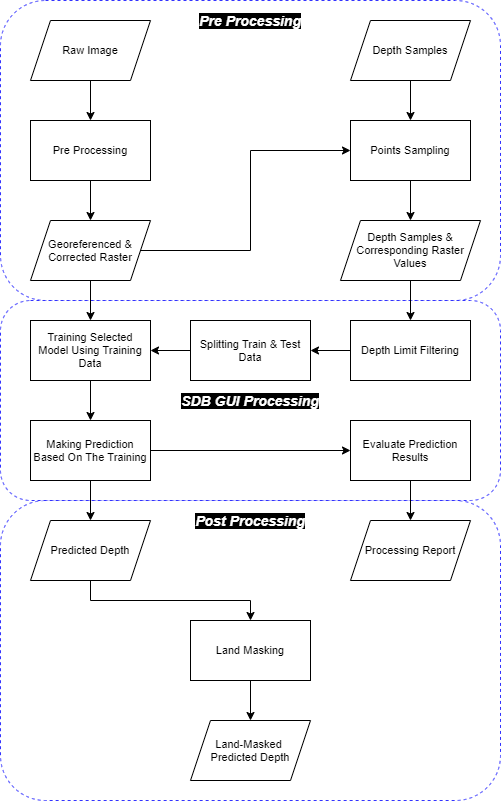

# Satellite Derived Bathymetry (SDB) GUI
Mainly, there are two methods to create a bathymetric prediction using satellite imagery. Two of which are analytical method and empirical method. The former predict depth using water body properties and calculate depth using some formula and those properties as variable input. The latter predict depth using depth training samples and fit the sample into some model and predict the depth using the model based on the depth sample training.

This is a GUI to make a bathimetric prediction using satellite imagery and some depth samples corresponding to the imagery. If you wish to use the GUI, please download the latest [release](https://github.com/rifqiharrys/sdb_gui/releases). Or if you want to run the source code (`sdb_gui.py`) instead, please install `python 3.6.x` and the following libraries first:

1. [Numpy](https://numpy.org/)
2. [Scipy](https://www.scipy.org/)
3. [Pandas](https://pandas.pydata.org/)
4. [Rasterio](https://rasterio.readthedocs.io/)
5. [Geopandas](https://geopandas.readthedocs.io/)
6. [Scikit Learn](https://scikit-learn.org)
7. [PyQt5](https://www.riverbankcomputing.com/static/Docs/PyQt5/)

Prepare your own data before using this SDB GUI. If you're running the latest [release](https://github.com/rifqiharrys/sdb_gui/releases), the required data are georeferenced and corrected imagery and tabular data consisting depth samples and corresponding raster values in the form of text file (e.g. CSV, TXT, or DAT file). If you don't have the second data, you could extract it from your depth sample and the first data using QGIS Plugin "Point Sampling Tool". If you're running from the source code, you have to load your depth samples in the form of ESRI Shapefile format and then SDB GUI will sample the depth for you.

Open SDB GUI and load both data. Choose one of the methods and decide how much of the sample you're going to use as training data. If you push `Make Prediction` button right away, the software will use default hyperparameters. If you want to tweak the hyperparameters, push `Options` button and it will show you some changeable hyperparameters depends on which method is selected.

After the prediction complete, you can save it into georeferenced raster file or XYZ ASCII file containing coordinates of each center of pixel. The prediction will show you depth values even on land. So, you have to mask the prediction result in the end and extracting prediction result of only water body.

## Workflow
Image below is the workflow of predicting bathymetric depth using SDB GUI if you're running the latest [release](https://github.com/rifqiharrys/sdb_gui/releases). If you're running directly from the latest source code, the point sampling process goes into "SDB GUI Processing".

## Methods
In order to make depth prediction, there are four methods available. The methods are [K-Nearest Neighbors](https://scikit-learn.org/stable/modules/generated/sklearn.neighbors.KNeighborsRegressor.html#sklearn.neighbors.KNeighborsRegressor), [Multiple Linear Regression](https://scikit-learn.org/stable/modules/generated/sklearn.linear_model.LinearRegression.html#sklearn.linear_model.LinearRegression "MLR Regression"), [Random Forest](https://scikit-learn.org/stable/modules/generated/sklearn.ensemble.RandomForestRegressor.html#sklearn.ensemble.RandomForestRegressor "RF Regressor") and [Support Vector Machines](https://scikit-learn.org/stable/modules/generated/sklearn.svm.SVR.html#sklearn.svm.SVR "SVM Regressor").

### K-Nearest Neighbors
This method implements learning based on k nearest neighbors of each query point. The adjustable hyperparameters for this method are number of neighbors, weights, algorithm, and leaf size. The default values are 3, distance, auto, and 300.

### Multiple Linear Regression
In Scikit Learn modules, this method called only with the name Linear Regression. The 'Multiple' implies that the Linear Regression is used on multiple features as input.

### Random Forest
The adjustable hyperparameters for Random Forest method are the number of trees and the function to measure the quality of a split (criterion). The default values respectively are 300 and mse (Mean Square Error). The other value for the criterion is mae (Mean Absolute Error).

### Support Vector Machines
The adjustable hyperparameters for SVM method are kernel type, kernel coefficient (gamma), regularization parameter (C), and degree (which working for polynomial kernel only). The default hyperparameter values are poly for kernel type, 0.1 for gamma, 1.0 for C, and 3 for degree.

## Features
SDB GUI has some features that helps in making prediction and saving output data. These features are Depth Limitation and Median Filter. User could disable one or both these features when they are not needed.

### Depth Limitation
Visible light that comes from the sun and goes through sea surface will weaken as it goes into the water body. The maximum depth the visible light could penetrate into water body varies depend on its water properties. Depth Limitation will filter depth on input sample and prediction output by creating accepted depth window from zero depth until selected depth limit (default value is -30).

### Median Filter
Median Filter is an image filter that will clear outliers (salt-and-pepper noise) that seems out of place from the depth prediction process. The default value of Median Filter size is 3. The filter size value should only in odd numbers because the matrix size of odd numbers will always have one array as the center.

## Releases
See [RELEASES](https://github.com/rifqiharrys/sdb_gui/releases)

## License
See [LICENSE](https://github.com/rifqiharrys/sdb_gui/blob/main/LICENSE)