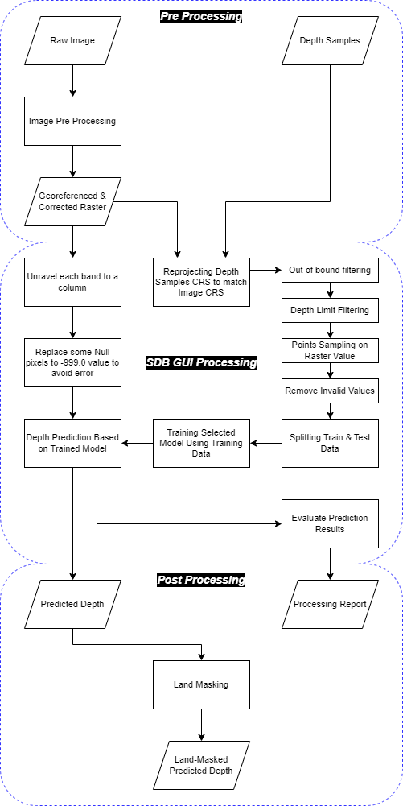
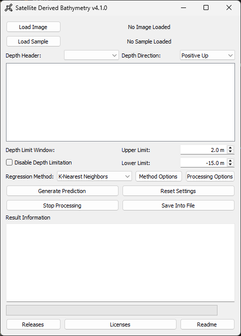

# Satellite Derived Bathymetry (SDB) GUI

[](https://github.com/rifqiharrys/sdb_gui/commit)
[](https://github.com/rifqiharrys/sdb_gui/releases/latest)
[](https://zenodo.org/doi/10.5281/zenodo.8220196)

## Preface

Mainly, there are two types of methods to create a bathymetric prediction using satellite imagery. Two of which are analytical methods and empirical methods. The former predicts depth using water body properties and then calculates depth using a formula and those properties as variable inputs. The latter predicts depth using depth training samples and fits the sample into a model and then predicts the depth using the model based on the depth sample training.

There are not many GUI (Graphical User Interface) based software to predict bathymetric depth using satellite imagery. Most of the software available are either commercial software or requires programming skills to use. In the age of automation, programming knowledge is a valuable skill to possess. However, not everyone has the time or the will to learn programming. This project aims to provide a GUI-based software that is easy to use and does not require programming skills to predict bathymetric depth using satellite imagery and depth samples.

Starting from version 4, the data processing and depth prediction processes are now moved from sdb_gui.py to a separate sdb package. This decision was made for two main reasons. The first is to simplify the code and make it easier to maintain. The second is to allow users to fully utilise the sdb package however they want, without the need to use the GUI.

This SDB project is using python and would not work without packages listed below:

|Packages|Description|
|---------|---------|
|[numpy](https://numpy.org/)|The fundamental package for scientific computing with Python. It provides functions for tasks such as array operations, matrix operations, and random number generation. It is the most widely used Python package for numerical computing.|
|[scipy](https://www.scipy.org/)|The SciPy library is one of the core packages that make up the SciPy stack. It provides functions for scientific and engineering applications. The SciPy library depends on NumPy, which provides support for large, multi-dimensional arrays and matrices, including a large collection of high-level mathematical functions to operate on these arrays. The SciPy library is built on top of the NumPy extension of the Python programming language. It adds functionality in several areas, including numerical integration, special functions, statistics, and optimization.|
|[pandas](https://pandas.pydata.org/)|Used for data manipulation and analysis. It offers data structures and functions to efficiently handle structured data, including tabular data such as spreadsheets and SQL tables.|
|[xarray](https://xarray.dev/)|The project integrates the array-orientated features of NumPy with the labeling features of Pandas. It provides a powerful and flexible way of working with labeled, multidimensional arrays.|
|[rioxarray](https://corteva.github.io/rioxarray)|Rioxarray is a Python package that enables the use of rasterio for xarray's raster-based operations. It provides an optional dependency for xarray, allowing it to read and write raster formats supported by rasterio.|
|[geopandas](https://geopandas.readthedocs.io/)|Geopandas extends the datatypes used by pandas to allow spatial operations on geometric types. It provides tools to read, write, and process geospatial data, making it easier to work with geographic datasets in Python.|
|[scikit-learn](https://scikit-learn.org)|A machine learning library for Python that features various classification, regression and clustering algorithms including support vector machines, random forests, gradient boosting, k-means and DBSCAN, and is designed to interoperate with the Python numerical and scientific libraries NumPy and SciPy.|
|[joblib](https://joblib.readthedocs.io/)|A set of tools to provide lightweight pipelining in Python. It is particularly useful for running tasks in parallel and for caching the results of function calls. In this project, joblib is used to speed up the processing time by parallelizing the prediction process.|
|[matplotlib](https://matplotlib.org/)|A plotting library for creating static, animated, and interactive visualizations in Python.|
|[pyqt5](https://www.riverbankcomputing.com/static/Docs/PyQt5/)|Used to create the GUI of this software. It is a set of Python bindings for Nokia's Qt application framework and runs on all platforms supported by Qt including Windows, OS X, Linux, iOS and Android.|

## Table of Contents

- [Satellite Derived Bathymetry (SDB) GUI](#satellite-derived-bathymetry-sdb-gui)
  - [Preface](#preface)
  - [Table of Contents](#table-of-contents)
  - [Workflow](#workflow)
  - [1. Setup and Preparation](#1-setup-and-preparation)
    - [a. Download executable file or source code](#a-download-executable-file-or-source-code)
    - [b. Python and packages installation](#b-python-and-packages-installation)
    - [c. Data preparation](#c-data-preparation)
  - [2. How To Use SDB GUI](#2-how-to-use-sdb-gui)
    - [a. Open SDB GUI and load data](#a-open-sdb-gui-and-load-data)
    - [b. Insert parameters and setting options](#b-insert-parameters-and-setting-options)
    - [c. Generate depth prediction](#c-generate-depth-prediction)
    - [d. Save depth prediction into file](#d-save-depth-prediction-into-file)
  - [3. Notebook](#3-notebook)
  - [Known Issues](#known-issues)
  - [Help and Support](#help-and-support)
  - [Releases](#releases)
  - [License](#license)
  - [Citation](#citation)

## Workflow

Image below is the workflow of predicting bathymetric depth using SDB GUI if you're running the latest [release](https://github.com/rifqiharrys/sdb_gui/releases) and the latest source code or release version 3 and up.



## 1. Setup and Preparation

### a. Download executable file or source code

You can download the latest [release](https://github.com/rifqiharrys/sdb_gui/releases) or clone the latest source code from [sdb_gui](https://github.com/rifqiharrys/sdb_gui). If you are using the executable version, you can skip the python and packages installation steps and head to [Data Preparation](#c-data-preparation).

### b. Python and packages installation

If you're downloading the source code, you need to have the packages from the table listed above installed. You can use `environment.yaml` file to help create new environment and install the library dependancies easily using `conda` or `mamba`. To use `conda` or `mamba`, you can use [Miniconda](https://docs.anaconda.com/miniconda/) or [Miniforge](https://github.com/conda-forge/miniforge). After one of them is installed, move to the root folder of the sdb_gui repo and run the command below.

```bash
conda env create -f environment.yaml
```

Or, if you prefer to use mamba. Replace `conda` with `mamba` from the same command line above. If you prefer using a python virtual environment or venv, you can install the dependancies using `requirements.txt` by running command below.

```bash
pip install -r requirements.txt
```

> Please note that using `conda` or `mamba` is highly recommended and preferred to avoid any issues, unless you know what you're doing.

### c. Data preparation

There are two types of data needed to use SDB GUI. They are:

1. Georeferenced and corrected imagery in GeoTIFF format
2. Depth samples in ESRI Shapefile format

The imagery required should be a multi-band imagery (e.g. RGB, RGBN, or others) in one stacked file. The depth samples doesn't have special requirements except if you want to process by attribute selection. In that case, the depth samples should have an additional field to differentiate the attributes which you want to select as training data, while the rest will marked as test data. Also, you need to understand the vertical reference and depth units of your depth samples because the results of prediction will be in the same units.

## 2. How To Use SDB GUI

### a. Open SDB GUI and load data

Open `sdb_gui_x.x.x_one_file.exe` if you're using the executable version or run `sdb_gui.py` if you're using the source code.

If you're using the executable version, you can open by double click on the file (`sdb_gui_x.x.x_one_file.exe`) or if you're using terminal, you can type `sdb_gui_x.x.x_one_file.exe` in the terminal in the same directory. If you're using the source code, run `sdb_gui.py` using python in your conda environment. Wait until SDB GUI opens and shows a window like the picture shown below. The preview of SDB GUI interface is available at [SDB GUI Preview document](./docs/sdb-gui-preview.md).



Load your data into SDB GUI. When your data is successfully loaded, the GUI will show the file name beside the load buttons.

### b. Insert parameters and setting options

After loading depth sample data, you will notice a table loaded with said data and show the first 100 rows (or all depend on your chosen setting while loading data). Above the table are two selection about the loaded sample data. The first one is the header of the depth data, while the second one is the direction of the depth data.

Correctly selecting depth header and depth direction is important because it will allow SDB GUI to process the data correctly. The first selection is the column name or header name of the column of the depth data. The selection will show all of the header/column names of the sample data. The second selection will show two options, which are **Positive Up** and **Positive Down**. If your depth data decreases in values as it goes deeper, choose **Positive Up** because the positive values are going up, otherwise choose **Positive Down**.

The next parameters are depth limitation window for sample data input. There are two values for depth limit window, upper limit (default value is 2) and lower limit (default value is -15). Both values are in the **Positive Up** direction manner. You could disable depth limitation by checking the Disable Depth Limitation checkbox.

Next, select your desired regression method. There are three options to select, which are K-Nearest Neighbors, Multiple Linear Regression, and Random Forest. For every regression method, you could change its hyperparameters by clicking the **Method Options** button. The explanation of every hyperparameter is in [scikit-learn user guide](https://scikit-learn.org/stable/user_guide.html).

On the right of the **Method Options** button is the **Processing Options** button which contain options related to the overall process that are unrelated to the regression method. Leaving it as is would set the processing parameters using default values and settings.

### c. Generate depth prediction

Generate depth prediction by pressing **Generate Prediction** button. While processing occurs, some information will be displayed under Result Information section. After the process completed, there will be a pop up alert showing the process is done. Any information regarding the processing will be displayed under Result Information section too.

### d. Save depth prediction into file

After depth prediction was generated, you can save it into a Geotiff or XYZ file. In the save file window, there are other options to use median filter to remove noise (default is on), save report, save train and test data, and create scatter plot using test data.

## 3. Notebook

To have a better understanding about the new SDB processing workflow in SDB GUI project, you could read the [Jupyter Notebook](./docs/) in this repository. There are two notebooks in this repository, which are `sdb-how-to-xarray-workflow.ipynb` and `sdb-module-how-to.ipynb`. Both notebooks contain a simple SDB processing workflow without GUI using Random Forest Regression.  The workflow of the first notebook might be a bit different from the recent SDB GUI, the basic idea is the same and this notebook is a prototype to the recent update (v4) of SDB GUI. The second notebook contain SDB processing using SDB module.

## Known Issues

Some issues that might occur based on user reports and personal testing are:

- incorrect depth data header selection
- incorrect selection of depth direction

SDB GUI might close unexpectedly due to issues above or other issues. The error messages might logged in `sdb_gui_error.log` or only shown in the terminal because exceptions are not handled properly. If you're running it using the excecutable version, it might help to run it using terminal to prevent the console from closing immediately after an error occurs.

## Help and Support

If you have any questions, issues, or suggestions, please open an issue or a discussion in this repository or contact me via email at [@rifqi.m.h](mailto:rifqi.m.h@gmail.com), [@rifqiharrys](mailto:rifqiharrys@proton.me) or what is displayed in my [GitHub profile](https://github.com/rifqiharrys/).

## Releases

See [RELEASES](https://github.com/rifqiharrys/sdb_gui/releases)

## License

See [LICENSE](./LICENSE)

## Citation

Please cite this project if you find this useful for your work or research using the metadata in the [CITATION](./CITATION.cff) file.
