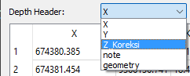

# SDB GUI Preview

This is a document that shows the SDB GUI v4.1.0 interface and a little bit about what they do. The first picture below shows the main window. Inside the main window are 11 buttons, 3 dropdown menus, 1 table field, 2 numeric input fields, 1 check box, and 1 text field. Additionally, if you are running the SDB GUI using the executable file, a console will shows up before the main GUI shows.

## Table of Contents

- [SDB GUI Preview](#sdb-gui-preview)
  - [Table of Contents](#table-of-contents)
  - [A. Buttons](#a-buttons)
    - [1. Load data](#1-load-data)
      - [a. Load image](#a-load-image)
      - [b. Load sample](#b-load-sample)
    - [2. Option buttons](#2-option-buttons)
      - [a. Method options](#a-method-options)
      - [b. Processing options](#b-processing-options)
      - [c. Reset settings](#c-reset-settings)
    - [3. Processing buttons](#3-processing-buttons)
      - [a. Generate prediction](#a-generate-prediction)
      - [b. Stop process](#b-stop-process)
    - [4. About buttons](#4-about-buttons)
      - [a. Releases](#a-releases)
      - [b. Licenses](#b-licenses)
      - [c. Readme](#c-readme)
  - [B. Dropdown menus](#b-dropdown-menus)
    - [1. Depth header](#1-depth-header)
    - [2. Depth direction](#2-depth-direction)
    - [3. Regression method](#3-regression-method)
  - [C. Table field](#c-table-field)
  - [D. Numeric inputs](#d-numeric-inputs)
    - [1. Upper limit](#1-upper-limit)
    - [2. Lower limit](#2-lower-limit)
  - [E. Check box](#e-check-box)
  - [F. Text field and progress bar](#f-text-field-and-progress-bar)
  - [G. Console](#g-console)

## A. Buttons

### 1. Load data

#### a. Load image

Pushing the "Load Image" button will open a window that allows users to load a GeotTIFF image file. After the user push the "Load" button, the image filename will show up beside the "Load Image" button as the image is loaded.

#### b. Load sample

Pushing the "Load Sample" button will open a window that allows user to load an ESRI Shapefile data. By default, after the user push the "Load" button, the first 100 data will show up on the table field under depth header dropdown menu and the filename will show up beside the "Load Sample" button as the shapefile is loaded.

### 2. Option buttons

These buttons are related to options functionalities in general or related to each ML method.

#### a. Method options

Pictures below show every method option windows while selecting each regression method and then pushing the "Method Options" button.

  

#### b. Processing options

Pushing the "Processing Options" button will open a window that allows user to change the general settings on the data processing such as parallel backend, number of processing cores, howt to evaluate the result, and how to select train data from all the samples.

#### c. Reset settings

Pushing the "Reset Settings" button will open a confirmation window to reset all options to default and saved last directory.

### 3. Processing buttons

#### a. Generate prediction

Pushing this button will start the depth prediction process using the selected ML method and options.

#### b. Stop process

Pushing this button will stop the ongoing depth prediction process.

### 4. About buttons

#### a. Releases

Pushing this button will direct the user to the SDB GUI releases.

#### b. Licenses

Pushing this button will open a window that shows the SDB GUI license and another related libraries that are used in the SDB GUI.

#### c. Readme

Pushing this button will direct the user to the README page in GitHub.

## B. Dropdown menus

### 1. Depth header

The "Depth Header" dropdown menu shows all headers or columns containing float data. The data under the selected header will be used as the depth sample. So, choose it correctly.

### 2. Depth direction

The option from the list are Positive Up and Positive Down. The user must select the option that matches the depth data from the loaded sample data. Positive Up means that the data that has the positive sign is pointed to up direction. Positive down means that the data that has the positive sign is pointed to down direction.

### 3. Regression method

There are the ML methods available, which are K-Nearest Neighbors (KNN), Multiple Linear Regression (MLR), and Random Forest (RF).

## C. Table field

This field shows a table of the loaded depth sample data.

## D. Numeric inputs

There are two numeric inputs in the main window, upper limit and lower limit inputs. Both of which are the number that limit the depth input values in the positive up manner. The depth limit number in the GUI will always shown using meter as it is the International Standard. If the loaded depth sample is in another unit, the unit shown in the GUI will not change.

### 1. Upper limit

The upper limit default value is 2.

### 2. Lower limit

The lower limit default value is -15.

## E. Check box

Check box to disable depth limitation.

## F. Text field and progress bar

The text field shows information about the ongoing process and the result, while the progress bar shows how far is the process going before it finishes.

## G. Console

While running SDB GUI, the console/terminal will shows processing logs. If you are using the executable file, a console will pop up and shows the processing logs.

